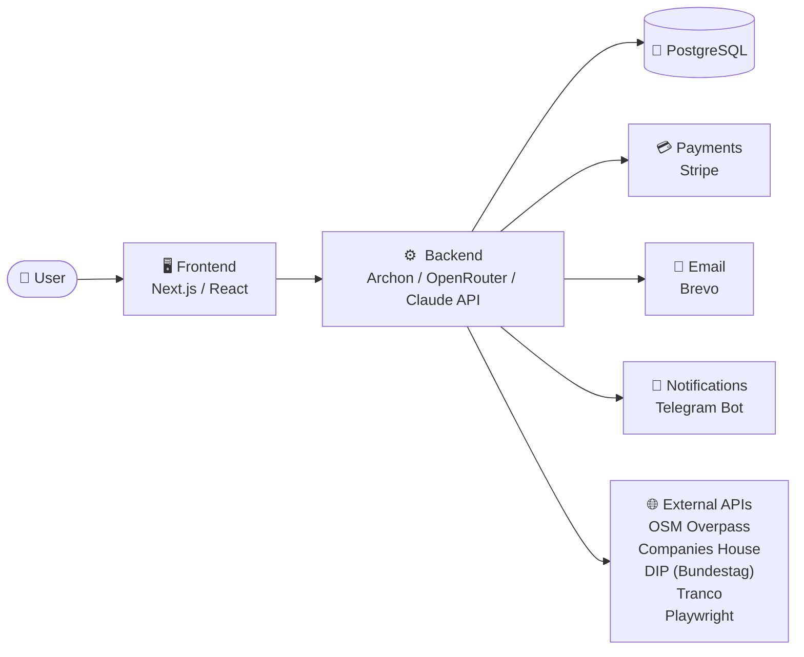

> 🤖 Auto-generiert – manuelle Edits werden überschrieben

# conformis — Übersicht

> Einstiegspunkt für **conformis**. Alle Specs, Tech-Stack-Refs und der
> Architektur-Schnitt — gepflegt durch `build_knowledge_graph.py`.

## Zweck / Geschäftsmodell

B2B-Compliance-SaaS-Pipeline. Tägliches Scannen, Bewerten und Kontaktieren von KMU-Websites mit Compliance-Lücken (DSGVO/DDG/UK GDPR/ePrivacy/etc.).

## Architektur



## Tech-Stack

- [[10_infrastruktur/Archon|Archon]] — *ai*
- [[10_infrastruktur/Brevo|Brevo]] — *email*
- [[10_infrastruktur/Caddy - Let's Encrypt|Caddy / Let's Encrypt]] — *infra*
- [[10_infrastruktur/Claude API|Claude API]] — *ai*
- [[10_infrastruktur/Companies House|Companies House]] — *external*
- [[10_infrastruktur/DIP (Bundestag)|DIP (Bundestag)]] — *external*
- [[10_infrastruktur/Docker|Docker]] — *infra*
- [[10_infrastruktur/DuckDNS|DuckDNS]] — *infra*
- [[10_infrastruktur/GSAP|GSAP]] — *frontend*
- [[10_infrastruktur/Hostinger VPS|Hostinger VPS]] — *infra*
- [[10_infrastruktur/Next.js|Next.js]] — *frontend*
- [[10_infrastruktur/OSM Overpass|OSM Overpass]] — *external*
- [[10_infrastruktur/OpenRouter|OpenRouter]] — *ai*
- [[10_infrastruktur/Playwright|Playwright]] — *external*
- [[10_infrastruktur/PostgreSQL|PostgreSQL]] — *db*
- [[10_infrastruktur/React|React]] — *frontend*
- [[10_infrastruktur/Stripe|Stripe]] — *payment*
- [[10_infrastruktur/Tailwind CSS|Tailwind CSS]] — *frontend*
- [[10_infrastruktur/Telegram Bot|Telegram Bot]] — *comms*
- [[10_infrastruktur/Three.js|Three.js]] — *frontend*
- [[10_infrastruktur/Tranco|Tranco]] — *external*
- [[10_infrastruktur/TypeScript|TypeScript]] — *frontend*

## 📄 Specs


**📁 00_start**

- [[20_projekte/conformis/00_start — admin_dashboard|admin_dashboard]]
- [[20_projekte/conformis/00_start — conformis___rechteradar|conformis___rechteradar]]
- [[20_projekte/conformis/00_start — system_uebersicht|system_uebersicht]]

**📁 01_setup**

- [[20_projekte/conformis/01_setup — agent_config|agent_config]]
- [[20_projekte/conformis/01_setup — docker_setup|docker_setup]]
- [[20_projekte/conformis/01_setup — environment_variables|environment_variables]]

**📁 02_agenten**

- [[20_projekte/conformis/02_agenten — fixer_bot|fixer_bot]]
- [[20_projekte/conformis/02_agenten — orchestrator|orchestrator]]

**📁 03_agents.md**

- [[20_projekte/conformis/03_agents.md — email_sender_agent|email_sender_agent]]
- [[20_projekte/conformis/03_agents.md — fixer_bot_agent|fixer_bot_agent]]
- [[20_projekte/conformis/03_agents.md — law_checker_agent|law_checker_agent]]
- [[20_projekte/conformis/03_agents.md — law_monitor_agent|law_monitor_agent]]
- [[20_projekte/conformis/03_agents.md — lead_finder_agent|lead_finder_agent]]
- [[20_projekte/conformis/03_agents.md — orchestrator_agent|orchestrator_agent]]
- [[20_projekte/conformis/03_agents.md — report_builder_agent|report_builder_agent]]
- [[20_projekte/conformis/03_agents.md — screenshot_tool_agent|screenshot_tool_agent]]
- [[20_projekte/conformis/03_agents.md — ux_auditor_agent|ux_auditor_agent]]
- [[20_projekte/conformis/03_agents.md — website_scanner_agent|website_scanner_agent]]

**📁 04_skills.md**

- [[20_projekte/conformis/04_skills.md — email_sender|email_sender]]
- [[20_projekte/conformis/04_skills.md — fixer|fixer]]
- [[20_projekte/conformis/04_skills.md — law_checker|law_checker]]
- [[20_projekte/conformis/04_skills.md — law_monitor|law_monitor]]
- [[20_projekte/conformis/04_skills.md — lead_finder|lead_finder]]
- [[20_projekte/conformis/04_skills.md — report_builder|report_builder]]
- [[20_projekte/conformis/04_skills.md — screenshot_tool|screenshot_tool]]
- [[20_projekte/conformis/04_skills.md — ux_auditor|ux_auditor]]
- [[20_projekte/conformis/04_skills.md — website_scanner|website_scanner]]

**📁 05_workflow**

- [[20_projekte/conformis/05_workflow — daily_batch_workflow|daily_batch_workflow]]
- [[20_projekte/conformis/05_workflow — outreach_3_5_9_regel|outreach_3_5_9_regel]]
- [[20_projekte/conformis/05_workflow — state_machine|state_machine]]

**📁 06_kommerz**

- [[20_projekte/conformis/06_kommerz — gesetzliche_grundlagen|gesetzliche_grundlagen]]
- [[20_projekte/conformis/06_kommerz — produkte_&_preise|produkte_&_preise]]
- [[20_projekte/conformis/06_kommerz — scoring_modell|scoring_modell]]

## 🔗 Cross-Project

- [[00_meta/Pattern-Dashboard|Pattern-Dashboard]] — Matrix aller Projekte und gemeinsamer Komponenten

## Status & nächste Schritte

_(Status manuell pflegen. Wenn du diese Datei manuell editieren willst,
entferne den AUTO_BANNER oben, sonst wird sie beim nächsten Lauf
überschrieben.)_

## Erkannte Indikatoren (Roh-Daten)

<details>
<summary>Tech-Stack-Files</summary>

```
['.env.example', 'Dockerfile', 'docker-compose.yml', 'package.json']
```

</details>

<details>
<summary>Compose Services / Images</summary>

```
services: ['app', 'caddy', 'cron', 'duckdns', 'init-workflows', 'postgres', 'web']
images:   ['alpine:3.20', 'caddy:2-alpine', 'conformis-archon', 'postgres:17-alpine']
```

</details>

<details>
<summary>Erkannte ENV-Variablen (Auszug)</summary>

```
['ADMIN_DOMAIN', 'ADMIN_SESSION_SECRET', 'APP_URL', 'ARCHON_DATA', 'ARCHON_HOME', 'BREVO_API_KEY', 'BREVO_REPLY_TO_EMAIL', 'BREVO_SENDER_EMAIL', 'BREVO_SENDER_NAME', 'BREVO_WEBHOOK_SECRET', 'CLAUDE_API_KEY', 'CLAUDE_CODE_OAUTH_TOKEN', 'CLAUDE_USE_GLOBAL_AUTH', 'COMPANIES_HOUSE_API_KEY', 'COST_ALERT_THRESHOLD', 'DAILY_COST_BUDGET_EUR', 'DAILY_EMAIL_CAP', 'DATABASE_URL', 'DEFAULT_AI_ASSISTANT', 'DIP_API_KEY', 'DUCKDNS_DOMAIN', 'DUCKDNS_TOKEN', 'HANDELSREGISTER_API_KEY', 'IONOS_EMAIL', 'IONOS_PASSWORD', 'JIMDO_EMAIL', 'JIMDO_PASSWORD', 'LEGAL_CITY', 'LEGAL_COUNTRY', 'LEGAL_EMAIL', 'LEGAL_HRB', 'LEGAL_NAME', 'LEGAL_PHONE', 'LEGAL_RESPONSIBLE', 'LEGAL_STREET', 'LEGAL_VAT_ID', 'LEGAL_ZIP', 'LE_EMAIL', 'MAX_TRANCO_RANK', 'NOTIFICATION_EMAIL']
```

</details>
