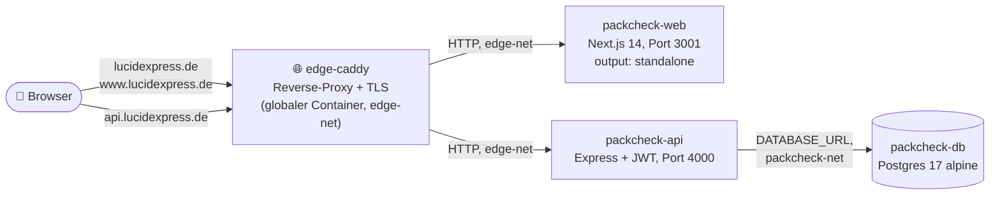

---
tags:
  - projekt/packcheck
---

> 🤖 Auto-generiert – manuelle Edits werden überschrieben

# PackCheck — Architektur

Zwei-Container-Setup hinter einem geteilten Edge-Reverse-Proxy. Frontend
und Backend liegen in **getrennten** Repos-im-Repo (`packcheck_frontend/`,
`packcheck_backend/`), damit jede Seite eigenes `package.json`,
`Dockerfile` und `docker-compose.yml` hat.

## System-Topologie



## Container-Schnitt

| Container | Image / Build | Port (intern) | Netze |
|---|---|---|---|
| `packcheck-web` | `packcheck-frontend:latest` (Next.js standalone) | 3001 | `edge-net` |
| `packcheck-api` | `packcheck-backend:latest` (Express + tsx-build) | 4000 | `edge-net` + `packcheck-net` |
| `packcheck-db` | `postgres:17-alpine` | 5432 (nicht exposed) | `packcheck-net` |

`packcheck-db` ist **nicht** im `edge-net` — Datenbank ist nur vom
Backend erreichbar. `packcheck-web` ist nicht im `packcheck-net` —
Frontend redet **nie** direkt mit der DB.

## Repo-Layout

```
packcheck/
├── packcheck_backend/
│   ├── docker-compose.yml      # api + db + packcheck_pgdata Volume
│   ├── Dockerfile
│   ├── migrations/001_init.sql # docker-entrypoint-initdb.d → idempotent
│   └── src/
│       ├── server.ts           # Express-Bootstrap, seedAdmin, /health
│       ├── env.ts              # zod-validierte env-Konfig (fail-fast)
│       ├── db.ts               # pg-Pool + waitForDb
│       ├── auth.ts             # bcrypt + jwt-Helpers + Cookie-Setter
│       ├── middleware/         # requireAuth, requireAdmin
│       └── routes/             # auth.ts, customer.ts, admin.ts
├── packcheck_frontend/
│   ├── docker-compose.yml      # web only, joined edge-net
│   ├── Dockerfile
│   ├── next.config.js          # output: 'standalone'
│   ├── middleware.ts           # cookie-basierter Route-Guard
│   ├── app/                    # App-Router: dashboard, admin, login, …
│   ├── components/             # Three.js, UI, Auth-Forms
│   └── lib/                    # axios-Client + API-Module
└── BACKEND_NOTES.md            # historische Notizen vor Cleanup 2026-05-14
```

## Datenfluss eines authentifizierten API-Calls

1. Browser stellt Request an `api.lucidexpress.de/customer/packaging`.
2. `edge-caddy` proxied auf `packcheck-api:4000` (TLS terminiert in
   Caddy, Backend trusted `X-Forwarded-For` via `app.set('trust proxy', 1)`).
3. `helmet` + `cors` (Allowlist `lucidexpress.de`/`www.lucidexpress.de`) +
   global `rateLimit(120/min)` + `pino-http` Logging.
4. `requireAuth`-Middleware liest entweder `Authorization: Bearer <jwt>`
   (so schickt es `lib/api.ts`) oder Cookie `token`, verifiziert HS256
   mit `JWT_SECRET`, setzt `req.user = { sub, isAdmin }`.
5. Route-Handler validiert Body mit zod, baut SQL via `pg`-Pool.
6. Response-JSON.

Siehe [[api_contract]], [[security_auth]], [[deployment]].
