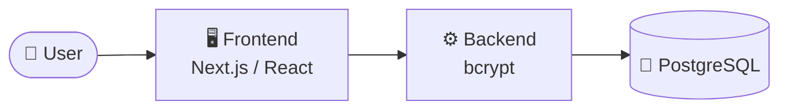

> 🤖 Auto-generiert – manuelle Edits werden überschrieben

# packcheck — Übersicht

> Einstiegspunkt für **packcheck**. Alle Specs, Tech-Stack-Refs und der
> Architektur-Schnitt — gepflegt durch `build_knowledge_graph.py`.

## Zweck / Geschäftsmodell

B2B-Verpackungsdaten-Verwaltung für **lucidexpress.de**. Kunden tragen quartalsweise ihre Verpackungsmengen (kg pro Verpackungstyp) ein, Admins generieren daraus Rechnungen und verwalten Stammdaten plus Kontakt-Notes.

## Architektur



## Tech-Stack

- [[10_infrastruktur/Caddy - Let's Encrypt|Caddy / Let's Encrypt]] — *infra*
- [[10_infrastruktur/Docker|Docker]] — *infra*
- [[10_infrastruktur/Hostinger VPS|Hostinger VPS]] — *infra*
- [[10_infrastruktur/Next.js|Next.js]] — *frontend*
- [[10_infrastruktur/PostgreSQL|PostgreSQL]] — *db*
- [[10_infrastruktur/React|React]] — *frontend*
- [[10_infrastruktur/Tailwind CSS|Tailwind CSS]] — *frontend*
- [[10_infrastruktur/Three.js|Three.js]] — *frontend*
- [[10_infrastruktur/TypeScript|TypeScript]] — *frontend*
- [[10_infrastruktur/bcrypt|bcrypt]] — *backend*

## 📄 Specs

- [[20_projekte/packcheck/api_contract|api_contract]]
- [[20_projekte/packcheck/architektur|architektur]]
- [[20_projekte/packcheck/datenbank|datenbank]]
- [[20_projekte/packcheck/deployment|deployment]]
- [[20_projekte/packcheck/frontend|frontend]]
- [[20_projekte/packcheck/offene_fragen|offene_fragen]]
- [[20_projekte/packcheck/security_auth|security_auth]]

## 🔗 Cross-Project

- [[00_meta/Pattern-Dashboard|Pattern-Dashboard]] — Matrix aller Projekte und gemeinsamer Komponenten

## Status & nächste Schritte

_(Status manuell pflegen. Wenn du diese Datei manuell editieren willst,
entferne den AUTO_BANNER oben, sonst wird sie beim nächsten Lauf
überschrieben.)_

## Erkannte Indikatoren (Roh-Daten)

<details>
<summary>Tech-Stack-Files</summary>

```
['.env.example', 'Dockerfile', 'docker-compose.yml', 'package.json']
```

</details>

<details>
<summary>Compose Services / Images</summary>

```
services: ['api', 'db', 'web']
images:   ['packcheck-backend:latest', 'packcheck-frontend:latest', 'postgres:17-alpine']
```

</details>

<details>
<summary>Erkannte ENV-Variablen (Auszug)</summary>

```
['API_URL', 'COOKIE_DOMAIN', 'COOKIE_SECURE', 'CORS_ORIGINS', 'INVOICE_RATE_EUR_PER_KG', 'JWT_EXPIRES_IN', 'JWT_SECRET', 'LOG_LEVEL', 'NEXT_PUBLIC_APP_URL', 'NODE_ENV', 'PORT', 'POSTGRES_DB', 'POSTGRES_PASSWORD', 'POSTGRES_USER', 'SEED_ADMIN_EMAIL', 'SEED_ADMIN_PASSWORD']
```

</details>
