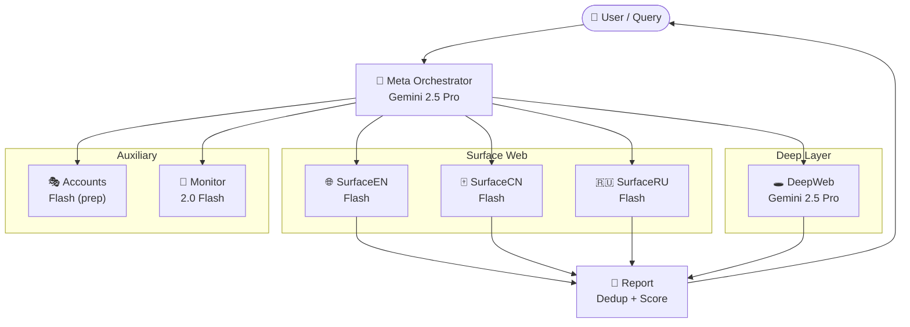

# research-monster — Übersicht

> Einstiegspunkt für **Research Monster**. Multi-Agent Deep-Research-System
> auf OpenClaw-Basis. Reproduzierbar, Docker-basiert, mehrsprachig (EN/DE/CN/RU).

## Zweck

Eine Query → 7 spezialisierte Agenten suchen parallel im Surface-Web,
Deep-Web und Tor → Ergebnisse werden dedupliziert, gescored und zu einem
Markdown-Report zusammengefügt.

20 Query-Typen werden unterstützt — von Technik, AI/KI und Cybersecurity
über Aktien-Geheimtipps und Insider-Trading bis hin zu Steueroptimierung,
Supply Chain und Patenten.

## Standort auf VPS

- **Pfad:** `/root/research-monster`
- **Gateway:** `http://localhost:18790`
- **Container:** `openclaw-research`
- **DB:** SQLite unter `./db/research.db`
- **Tor:** SOCKS5 auf `127.0.0.1:9050` (Client-Bridge, kein Exit-Node)

## Architektur



## Agenten

| Agent | Modell | Zuständigkeit | Spec |
|---|---|---|---|
| Meta | Gemini 2.5 Pro | Routing, Synthese, Report | [[20_projekte/research-monster/03_agents.md — meta\|meta]] |
| SurfaceEN | Gemini 2.5 Flash | Google, Bing, DuckDuckGo, Brave (EN/DE) | [[20_projekte/research-monster/03_agents.md — surface-en\|surface-en]] |
| SurfaceCN | Gemini 2.5 Flash | Baidu, Sogou, Bing CN | [[20_projekte/research-monster/03_agents.md — surface-cn\|surface-cn]] |
| SurfaceRU | Gemini 2.5 Flash | Yandex, Bing RU, Mail.ru | [[20_projekte/research-monster/03_agents.md — surface-ru\|surface-ru]] |
| DeepWeb | Gemini 2.5 Pro | Archive.org, Shodan, WHOIS, Gov, Tor | [[20_projekte/research-monster/03_agents.md — deepweb\|deepweb]] |
| Accounts | Gemini 2.5 Flash | Nstbrowser + FCE + CapSolver (prep) | [[20_projekte/research-monster/03_agents.md — accounts\|accounts]] |
| Monitor | Gemini 2.0 Flash | RSS, Feeds, periodische Checks | [[20_projekte/research-monster/03_agents.md — monitor\|monitor]] |

## Skills (Funktionen)

| Skill | Funktion | Spec |
|---|---|---|
| deep-web | Archive, Shodan, WHOIS, Gov-Data, Academic | [[20_projekte/research-monster/04_skills.md — deep-web\|deep-web]] |
| surface-search-en | Google, Bing, DDG, Brave (EN/DE) | [[20_projekte/research-monster/04_skills.md — surface-search-en\|surface-search-en]] |
| surface-search-cn | Baidu, Sogou, Bing CN | [[20_projekte/research-monster/04_skills.md — surface-search-cn\|surface-search-cn]] |
| surface-search-ru | Yandex, Bing RU, Mail.ru | [[20_projekte/research-monster/04_skills.md — surface-search-ru\|surface-search-ru]] |
| tor-onion-search | Ahmia, Torch, Haystack via Tor SOCKS5 | [[20_projekte/research-monster/04_skills.md — tor-onion-search\|tor-onion-search]] |
| account-creation | Fingerprint-Spoof, Disposable Mail, Captcha | [[20_projekte/research-monster/04_skills.md — account-creation\|account-creation]] |
| content-filter | Hardcoded Blocklist (CSAM/Gore/Gewalt) | [[20_projekte/research-monster/04_skills.md — content-filter\|content-filter]] |
| report-generator | Dedup, Scoring, Markdown + JSON Report | [[20_projekte/research-monster/04_skills.md — report-generator\|report-generator]] |

## Query-Typ-Routing

| Typ | Agenten | Sprachen |
|---|---|---|
| Technik | deepweb + surface-en/cn/ru | EN+CN+RU |
| Digitales Geld | surface-en/cn/ru + deepweb | EN+CN+RU |
| Verborgenes Wissen | deepweb + surface-en/cn | EN+CN |
| AI / KI | deepweb + surface-en/cn/ru | EN+CN+RU |
| Psychologie | deepweb + surface-en | EN/DE |
| Geld durch Wissen | surface-en/cn/ru + deepweb | EN+CN+RU |
| Geschichte | deepweb + surface-en | EN/DE |
| Gesetzeslücken | deepweb + surface-en/cn/ru | EN+CN+RU |
| Gesundheit | deepweb + surface-en/cn | EN+CN |
| Sonderangebote | surface-en/cn/ru | EN+CN+RU |
| Rabatte | surface-en/cn/ru | EN+CN+RU |
| Aktien | surface-en/cn/ru + deepweb | EN+CN+RU |
| Aktien-Geheimtipps | deepweb + surface-en/cn | EN+CN |
| Insider-Trading | deepweb + surface-en/cn/ru | EN+CN+RU |
| Cybersecurity | deepweb + surface-en/cn/ru | EN+CN+RU |
| Crypto / DeFi | deepweb + surface-en/cn/ru | EN+CN+RU |
| OSINT | deepweb + surface-en/cn/ru | EN+CN+RU |
| Steueroptimierung | deepweb + surface-en/cn/ru | EN+CN+RU |
| Supply Chain | deepweb + surface-en/cn | EN+CN |
| Patente / IP | deepweb + surface-en/cn | EN+CN |

## Tech-Stack

- [[10_infrastruktur/Docker|Docker]] — Container-Runtime
- [[10_infrastruktur/Hostinger VPS|Hostinger VPS]] — Host
- OpenClaw Gateway (`ghcr.io/openclaw/openclaw:latest`) — Multi-Agent-Framework
- Gemini 2.5 Pro / 2.5 Flash / 2.0 Flash (Google AI Studio) — LLM-Backbone
- Tor SOCKS5 Bridge — Anonymisierung für .onion-Quellen
- SQLite — Result-Persistierung
- FreeCustom.Email (prep), Nstbrowser (prep), CapSolver (prep) — Account-Stack

## Relevanz-Scoring

| Score | Bedeutung |
|---|---|
| 90–100 | Exakte Übereinstimmung, autoritative Quelle |
| 70–89 | Gute Übereinstimmung, relevant |
| 40–69 | Teilweise relevant, ergänzend |
| <40 | Wird verworfen |

## Content Filter (hardcoded)

Folgende Kategorien werden niemals gesucht, gespeichert oder zusammengefasst:
**CSAM**, **Gore**, **Extreme Gewalt**.
Bei Fund: Quelle verlassen, URL in `blocked_urls.json` aufnehmen, weitermachen — niemals erwähnen oder beschreiben.

Details: [[20_projekte/research-monster/04_skills.md — content-filter|content-filter]]

## Befehle

```bash
# Starten
docker compose up -d

# Logs
docker compose logs -f openclaw-research

# Shell in Container
docker exec -it openclaw-research sh

# Tor-Connectivity prüfen
docker exec openclaw-research \
  curl --socks5-hostname 127.0.0.1:9050 \
  https://check.torproject.org/api/ip

# DB inspizieren
docker exec openclaw-research \
  sqlite3 /root/research-db/research.db ".tables"
```

## Roadmap (inaktiv)

| Feature | Status | Benötigt |
|---|---|---|
| Captcha-Solving | vorbereitet | `CAPSOLVER_API_KEY` |
| Account Creation | vorbereitet | Nstbrowser + FCE + CapSolver Keys |
| ComplianceGuard | geplant | Eigenes Projekt |
