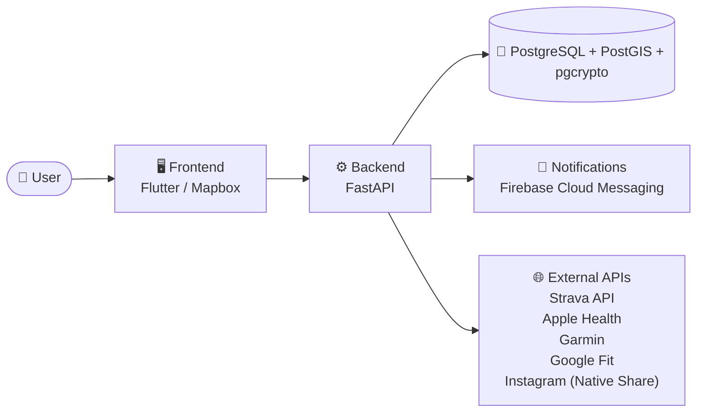

> 🤖 Auto-generiert – manuelle Edits werden überschrieben

# running_app — Übersicht

> Einstiegspunkt für **running_app**. Alle Specs, Tech-Stack-Refs und der
> Architektur-Schnitt — gepflegt durch `build_knowledge_graph.py`.

## Zweck / Geschäftsmodell

Source repository for **tutgut** — a social running app. Specs live in the sibling repo `running_app` (`docs/`); the canonical backend contract is `datenbank_doku_vollständig.md`.

## Architektur



## Tech-Stack

- [[10_infrastruktur/Apple Health|Apple Health]] — *external*
- [[10_infrastruktur/Docker|Docker]] — *infra*
- [[10_infrastruktur/FastAPI|FastAPI]] — *backend*
- [[10_infrastruktur/Firebase Cloud Messaging|Firebase Cloud Messaging]] — *comms*
- [[10_infrastruktur/Flutter|Flutter]] — *frontend*
- [[10_infrastruktur/Garmin|Garmin]] — *external*
- [[10_infrastruktur/Google Fit|Google Fit]] — *external*
- [[10_infrastruktur/Hostinger VPS|Hostinger VPS]] — *infra*
- [[10_infrastruktur/Instagram (Native Share)|Instagram (Native Share)]] — *external*
- [[10_infrastruktur/Mapbox|Mapbox]] — *frontend*
- [[10_infrastruktur/PostGIS|PostGIS]] — *db*
- [[10_infrastruktur/PostgreSQL|PostgreSQL]] — *db*
- [[10_infrastruktur/Strava API|Strava API]] — *external*
- [[10_infrastruktur/pgcrypto|pgcrypto]] — *db*

## 📄 Specs


**📁 _root_**

- [[20_projekte/running_app/SPEC_unity_avatar|SPEC_unity_avatar]]
- [[20_projekte/running_app/adr_001_masterplan|adr_001_masterplan]]
- [[20_projekte/running_app/adr_002_aktualisierung|adr_002_aktualisierung]]
- [[20_projekte/running_app/adr_003_avatar_genies|adr_003_avatar_genies]]
- [[20_projekte/running_app/avatar_personalisierung|avatar_personalisierung]]
- [[20_projekte/running_app/datenbank_doku_vollständig|datenbank_doku_vollständig]]
- [[20_projekte/running_app/events_communities|events_communities]]
- [[20_projekte/running_app/interaktive_karte|interaktive_karte]]
- [[20_projekte/running_app/scoreboard_leaderboard|scoreboard_leaderboard]]
- [[20_projekte/running_app/user_profile|user_profile]]
- [[20_projekte/running_app/visuelle_darstellung|visuelle_darstellung]]

**📁 superpowers**

- [[20_projekte/running_app/superpowers — specs — 2026-05-04-p1-unity-setup-design|specs — 2026-05-04-p1-unity-setup-design]]

## 🔗 Cross-Project

- [[00_meta/Pattern-Dashboard|Pattern-Dashboard]] — Matrix aller Projekte und gemeinsamer Komponenten

## Status & nächste Schritte

_(Status manuell pflegen. Wenn du diese Datei manuell editieren willst,
entferne den AUTO_BANNER oben, sonst wird sie beim nächsten Lauf
überschrieben.)_

## Erkannte Indikatoren (Roh-Daten)

<details>
<summary>Tech-Stack-Files</summary>

```
['.env.example', 'Dockerfile', 'docker-compose.yml', 'pyproject.toml']
```

</details>

<details>
<summary>Compose Services / Images</summary>

```
services: ['backend', 'postgres']
images:   ['postgis/postgis:16-3.4']
```

</details>

<details>
<summary>Erkannte ENV-Variablen (Auszug)</summary>

```
['TUTGUT_DATABASE_URL', 'TUTGUT_ENV', 'TUTGUT_LOG_LEVEL']
```

</details>
